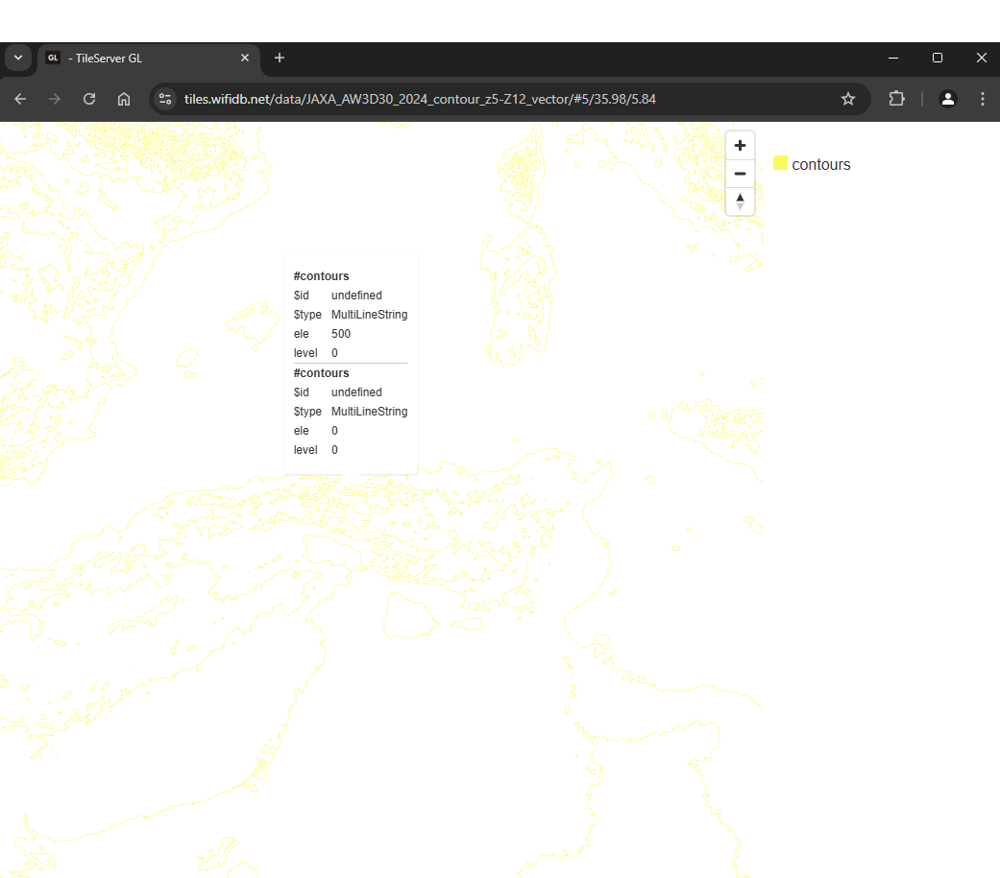

# Contour Generator

Generate contour lines from terrain elevation data and output them as Mapbox Vector Tiles (MVT). This tool converts Digital Elevation Model (DEM) raster data into vector contour lines that can be used in web maps, GIS applications, and other mapping tools.

Built on [maplibre-contour](https://github.com/onthegomap/maplibre-contour) for reliable contour generation, it outputs standard MVT tiles compatible with MapLibre GL JS, Mapbox GL JS, and other vector tile consumers. The tool handles tile pyramids automatically, generating appropriate detail levels for each zoom with contour density optimized for web map performance.

 <!-- Add actual image -->

## What are contour lines?
Contour lines connect points of equal elevation on a map, helping visualize terrain shape and steepness. They're essential for topographic maps, hiking applications, and terrain analysis.

## Quick Start

**Install globally via npm:**
```bash
npm install -g contour-generator
```

**Generate your first contour map:**
```bash
contour-generator pyramid \
  --z 9 --x 272 --y 179 \
  --demUrl "pmtiles://https://acalcutt.github.io/contour_generator/test_data/terrain-tiles.pmtiles" \
  --sourceMaxZoom 12 \
  --outputMaxZoom 15 \
  --outputDir "./my-contours"
```

This creates contour lines for a small area in the Alps. Check the `./my-contours` directory for the generated tiles, then jump to [Using the Output](#using-the-output) to see how to view them.

## Prerequisites

- Node.js 16 or higher
- At least 2GB free disk space for processing
- Internet connection (for remote DEM sources)

## Installation

### Option 1: Global Installation (Recommended)
```bash
npm install -g contour-generator

# Verify installation
contour-generator --help
```

### Option 2: Local Development
```bash
git clone https://github.com/acalcutt/contour-generator.git
cd contour-generator
npm install

# Run with
node . --help
```

### Option 3: Docker
```bash
# No installation needed - runs in container
docker run --rm wifidb/contour-generator --help
```

## Core Concepts

### Generation Functions
- **`pyramid`**: Generate contours for a single map tile and all its children
- **`zoom`**: Process all tiles at a specific zoom level
- **`bbox`**: Process all tiles within a geographic bounding box

### DEM Sources
The tool supports various elevation data sources:
- **PMTiles**: `pmtiles:///path/to/file.pmtiles` (local) or `pmtiles://https://foo.lan/file.pmtiles` (HTTP)
- **MBTiles**: `mbtiles:///path/to/file.mbtiles` (local only)
- **Tile server**: `https://example.com/{z}/{x}/{y}.png`

### Encodings
- **`terrarium`**: RGB encoding where elevation = (R × 256² + G × 256 + B) / 256 - 32768
- **`mapbox`**: RGB encoding where elevation = -10000 + ((R × 256² + G × 256 + B) × 0.1)

## Usage Examples

### Generate contours for a specific area (pyramid)

```bash
contour-generator pyramid \
  --z 9 --x 272 --y 179 \
  --demUrl "pmtiles://https://acalcutt.github.io/contour_generator/test_data/terrain-tiles.pmtiles" \
  --sourceMaxZoom 12 \
  --encoding mapbox \
  --increment 50 \
  --outputMaxZoom 15 \
  --outputDir "./output"
```
*Generates contours for tile 9/272/179 and all child tiles up to zoom 15, with 50m elevation intervals*

### Process an entire zoom level

```bash
contour-generator zoom \
  --demUrl "pmtiles://./elevation-data.pmtiles" \
  --sourceMaxZoom 7 \
  --outputMinZoom 5 \
  --outputMaxZoom 7 \
  --increment 100 \
  --outputDir "./output"
```
*Processes all tiles from zoom 5 to 7 with 100m contour intervals*

### Process a geographic area (bbox)

```bash
contour-generator bbox \
  --minx -73.51 --miny 41.23 \
  --maxx -69.93 --maxy 42.88 \
  --demUrl "https://s3.amazonaws.com/elevation-tiles-prod/terrarium/{z}/{x}/{y}.png" \
  --sourceMaxZoom 15 \
  --encoding terrarium \
  --increment 50 \
  --outputMinZoom 5 \
  --outputMaxZoom 10 \
  --outputDir "./output"
```
*Generates contours for New England area with 50m intervals*

### Docker Usage

When using Docker, map your local directory to `/data` inside the container:

```bash
# Download test data
wget https://github.com/acalcutt/contour_generator/releases/download/test_data/JAXA_2024_terrainrgb_z0-Z7_webp.pmtiles

# Run with Docker
docker run --rm -v $(pwd):/data wifidb/contour-generator \
  zoom \
  --demUrl "pmtiles:///data/JAXA_2024_terrainrgb_z0-Z7_webp.pmtiles" \
  --outputDir "/data/output" \
  --sourceMaxZoom 7 \
  --outputMaxZoom 7 \
  --increment 100
```

**Important**: All file paths in Docker must be under `/data/` since that's where your local directory is mounted.

## Configuration Options

### General Parameters

| Parameter | Default | Description |
|-----------|---------|-------------|
| `--demUrl` | *required* | DEM source URL or file path |
| `--encoding` | `mapbox` | DEM encoding format (`mapbox` or `terrarium`) |
| `--sourceMaxZoom` | `8` | Maximum zoom of source DEM tiles |
| `--increment` | `0` | Contour interval in meters (0 = auto thresholds) |
| `--outputMaxZoom` | `8` | Maximum zoom of output tiles |
| `--outputDir` | `./output` | Directory for generated tiles |
| `--processes` | `8` | Parallel processes (adjust for your CPU) |
| `--verbose` | `false` | Enable detailed logging |

### Function-specific Parameters

**pyramid function:**
- `--x`, `--y`, `--z`: Tile coordinates (required)

**zoom function:**
- `--outputMinZoom`: Starting zoom level (default: 5)

**bbox function:**
- `--minx`, `--miny`, `--maxx`, `--maxy`: Bounding box coordinates (required)
- `--outputMinZoom`: Starting zoom level (default: 5)

### Advanced Options

| Parameter | Default | Description |
|-----------|---------|-------------|
| `--blankTileNoDataValue` | `0` | Elevation for missing tiles |
| `--blankTileSize` | `512` | Tile size in pixels |
| `--blankTileFormat` | `png` | Format for generated blank tiles |

## Using the Output

The tool generates:
- **Tile files**: `output/{z}/{x}/{y}.pbf` - Vector tiles containing contour lines
- **Metadata**: `metadata.json` - Tile set information

### Converting to MBTiles
```bash
# Install mbutil (Python package)
pip install mbutil

# Convert directory to MBTiles
mb-util --image_format=pbf ./output contours.mbtiles
```

### Viewing in a web map
```javascript
// Add to MapLibre GL JS
map.addSource('contours', {
    type: 'vector',
    tiles: ['http://localhost:3000/{z}/{x}/{y}.pbf'],
    maxzoom: 15
});

map.addLayer({
    id: 'contour-lines',
    type: 'line',
    source: 'contours',
    'source-layer': 'contours',
    paint: {
        'line-color': '#8B4513',
        'line-width': 1
    }
});
```

## Performance Guidelines

### Processing Time Estimates
- **Single tile (pyramid)**: 10-60 seconds
- **Full zoom level**: Minutes to hours depending on area
- **Large bbox**: Can take several hours

### System Requirements
- **RAM**: 4GB minimum, 8GB+ recommended for large areas
- **Storage**: ~1MB per tile generated
- **CPU**: More processes = faster completion (try `--processes` = CPU cores)

### Optimization Tips
- Use local DEM files when possible (faster than HTTP)
- Start with higher `--increment` values for faster processing
- Test with small areas (`pyramid`) before large batch jobs
- Monitor disk space - large bbox operations can generate many GB

## Troubleshooting

### Common Issues

**"No tile returned" messages**
- Normal for sparse datasets (like JAXA over oceans)
- Check if your coordinates are within the DEM coverage area

**Out of memory errors**
- Reduce `--processes` count
- Process smaller areas at a time
- Increase system swap space

**Permission errors (Docker)**
- Ensure output directory is writable: `chmod 755 $(pwd)`
- On Windows, use full path: `-v C:\path\to\data:/data`

**Slow processing**
- Use local files instead of HTTP sources
- Reduce `--outputMaxZoom` for testing
- Check internet connection for remote sources

### Getting Help

```bash
# View general help
contour-generator --help

# Function-specific help
contour-generator pyramid --help
contour-generator zoom --help
contour-generator bbox --help
```

## Data Sources & Licensing

### Test Data
- **AWS Terrain Tiles**: [terrain-tiles on AWS Open Data](https://registry.opendata.aws/terrain-tiles/)
- **JAXA AW3D30**: [JAXA Earth Data Policy](https://earth.jaxa.jp/en/data/policy/)

